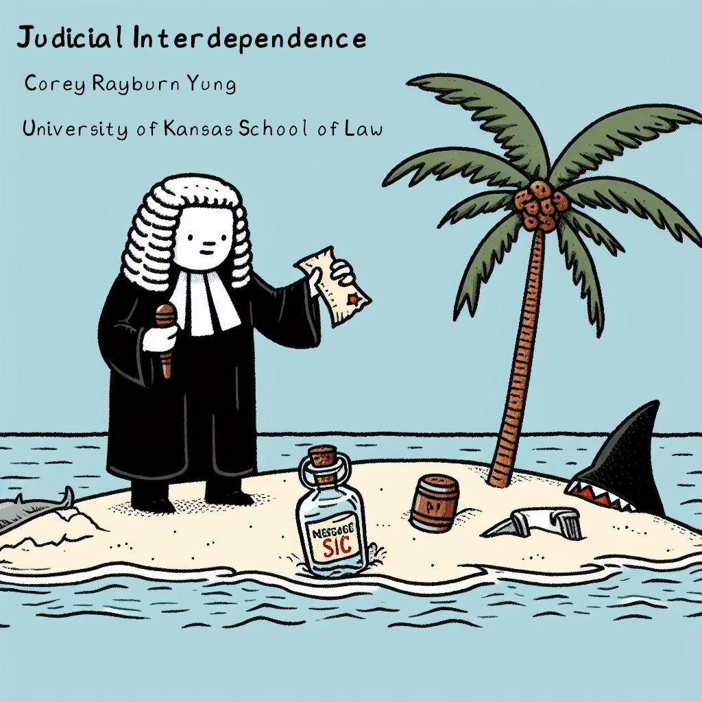
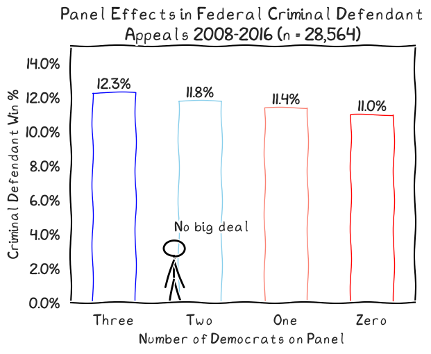
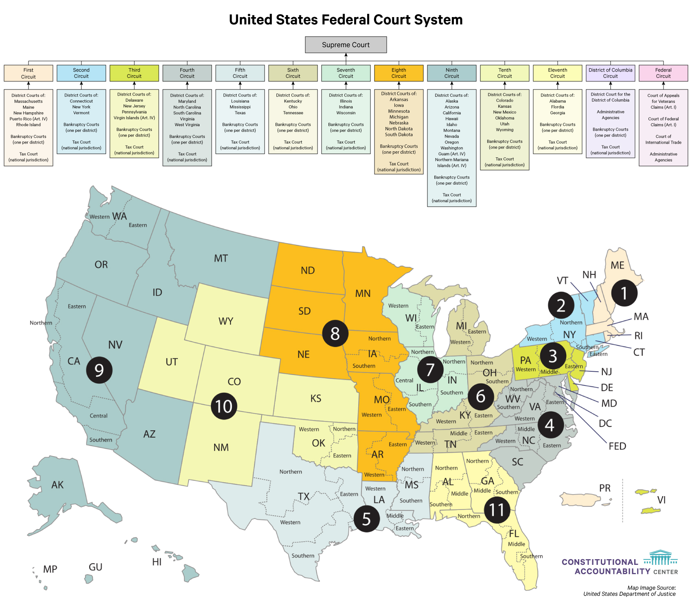

---

---

---

## **Resources**
  
- Code for Charts and Slides hosted on:
  - : https://github.com/WithPrecedent/judge_islands

- Charts made using:
  - 
  - 
  - 

- Slides made using: 
  - 
  -  for 

- Title page made using: 
  -  (powered by DALL·E 3): https://www.bing.com/create

